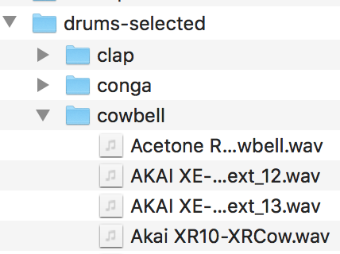

# SpecGAN - generate audio with adversarial training

an unofficial implementation of SpecGAN, a Generative Adversarial Network model for generating spectrogram images,  proposed in:
_*Donahue, C., McAuley, J., & Puckette, M. (2018). Synthesizing Audio with Generative Adversarial Networks.*_
http://arxiv.org/abs/1802.04208  

   


Requirements
---
- keras >= 2.1
- tensorflow >= 1.4
- librosa
- soundfile
- Python 2


Dataset
--

Audio files for the training should be placed in the following manner: each directory (_clap_, _conga_...) in the root directory (_drums-selected_) contains sounds belonging to the category respectively.

   

For your convenience, here is [a small dataset of drum machine sounds](https://drive.google.com/open?id=1pOIBkOjjafFmHRlB218dyYZ7DsoR8Oyy).

Preprocess
---

At first, you need to create a .npz archive containing normalized spectrogram images of training audio files and category info. It may take a few minutes to an hour depending on the number of files in your dataset.

```
$ python preprocess_audio.py -i ./drums-selected/ -o ./training_data.npz
```


Training
---

Then, start training using the created training data!    

```
$ python specgan_categorical.py -i ./training_data.npz -o ./checkpoints -e 200
```

```
-i filepath to the training data created with proprocess_audio.py
-e number of Epochs
-o path to a directory, where the script saves generated spectrogram images, audio and models  
```

Generate Sounds
---

Once trained, you can use the trained models to generate random sounds and classify them. see [this jupyter notebook](https://github.com/naotokui/SpecGAN/blob/master/examples/generate-sound.ipynb).  

Result
---

In the training process, the script generates spectrogram images and audio from random seeds in the directory specified with -o argument, so that you can check how the training goes.

If you are interested in how it actually sounds, please take look at this short video clip.  In this video, I tried to keep generating random drum sounds from random seeds, classifying them with a trained discriminator and replacing the sound in the drum kit. It ended up an ever-changing drum sequence.

[GAN-808 Drum Machine (YouTube)](https://www.youtube.com/watch?v=z15mU3UORmo)  


Credits 🙏
---
- The implementation of Improved Wasserstein GAN proposed in https://arxiv.org/abs/1704.00028 was based on [a keras implementation](
https://github.com/keras-team/keras-contrib/blob/master/examples/improved_wgan.py).

- Spectrogram to Audio conversion (Griffin-Lim algorithm) was based on [Yunchao He's implementation](https://github.com/candlewill/Griffin_lim).
